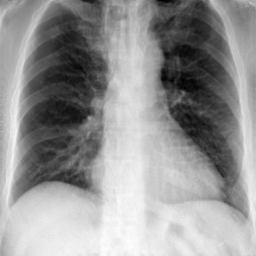

Note: sample data (cropped chest Xray image) is in the test_data folder
# Dependencies

- Ubuntu 16.04
- Python 3.7
- CUDA 10.0
- gcc/g++ 7.4
- Pytorch 1.3.1
- Torchvision 0.4.2

bash install.sh to install the custom differentiable forward projection operator.

trained model can be downloaded in https://livejohnshopkins-my.sharepoint.com/:u:/g/personal/cpeng26_jh_edu/Eb8dd9fDON1LintGJ-q7cIUBZNY_NnWZPOkRcrWLk4S2iw?e=d3aasu

decompress the ct2xray_real_gan_meta folder under run/

To run XraySyn and obtain the estimated volume + bone + tissue content:
```
python script/test_ct2xray_real.py ct2xray_real_gan_meta
```

Results will be saved in the vis folder.

